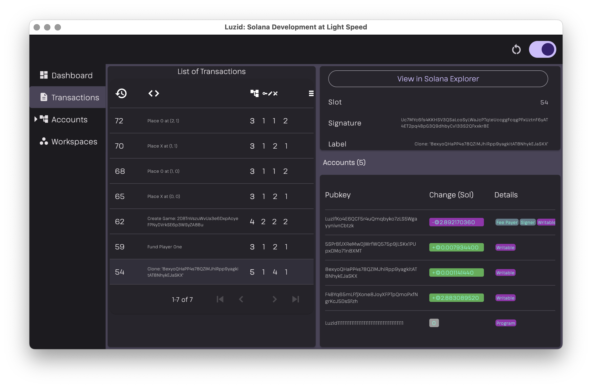

+++
title = "Luzid Alpha Prerelease"
description = "Introducing the first (semi) public Luzid Release"
date = 2024-03-09T15:00:00+00:00
updated = 2024-03-09T15:00:00+00:00
draft = false
template = "blog/page.html"

[taxonomies]
authors = ["Thorsten Lorenz"]

[extra]
lead = "🎉 It's been a long time coming. The first Luzid Alpha is here! 🎉"

[page]
toc = true
+++

I expect you have been waiting patiently to get your hands on a copy of Luzid and I've been
working hard behind the scenes to make it happen. I'm excited to announce that the first Luzid
Alpha is now ready to be released to early adopters.

## Features

You can learn about the list of features that Luzid currently provides by watching the videos
in [this playlist](https://www.youtube.com/playlist?list=PL4k64WemroGk4B_NHN337425VDC1Fsn5D).

The [Luzid: Solana Test Validator on
Steroids](https://www.youtube.com/watch?v=3J_42C6xuNM&list=PL4k64WemroGk4B_NHN337425VDC1Fsn5D&index=2)
video describes the following features:

- Luzid Dashboard showing the status of the Validator
- Viewing Transactions and inspecting Parsed Transaction Account Data
- Cloning Remote Accounts into Luzid
- Creating and Restoring Account Snapshots
- Stopping/Starting the Validator

In order to learn about the Luzid _Hotswap_ feature I recommend watching
[Luzid: Hotswapping Programs after each Compile without Deploys or Validator Restart](https://www.youtube.com/watch?v=Nbb88N1JvyE&list=PL4k64WemroGk4B_NHN337425VDC1Fsn5D&index=5)

The [Luzid: controlling your Validator via the SDK from your tests or
application](https://www.youtube.com/watch?v=M09YWUicVF0&list=PL4k64WemroGk4B_NHN337425VDC1Fsn5D&index=2)
explains how to control Luzid via TypeScript from a webpage or your tests.

Make sure to read through the [SDK
examples](https://github.com/luzid-app/luzid-sdk/tree/master/ts/examples) as well.

## Versions and Release Pages

The following versions are available:

- **Luzid Alpha for MacOS**: [release page](https://github.com/luzid-app/luzid-sdk/releases/tag/macos-v0.0.2)
- **Luzid Alpha for Linux**: [release page](https://github.com/luzid-app/luzid-sdk/releases/tag/linux-v0.0.2)

I advise especially **MacOS users** to **read the release notes carefully** as the installation process
will be much easier as a result. However to help you in case issues arise, I've also prepared a
video tutorial for you that is linked in the release notes.

For Linux the installation process is much simpler especially if you're on the latest LTS version of
your distro.

Windows can install the command line only version [see Headless CLI](#headless-cli) and run it in WSL.
However for now a GUI for windows is not available until the release coming in a few weeks [see
below](#plans-going-forward).

### Luzid UI

MacOS users can install the Luzid UI via the following file which will work on both Intel and ARM:

- `luzid.app.tar.gz`

Linux users can install the Luzid UI via the following file:

- `luzid.tar.gz`

_The release notes for each version contain more installation instructions._

### Headless CLI

The Luzid UI embeds the Luzid validator, however you may want to run the validator separately.

To that end a _headless_ Luzid version is available for MacOS, Linux and Windows (using the
Linux version via WSL). You can find it as part of the _Assets_ of the respective releases.

On MacOS install either of the below:

- `lzd_aarch64-apple-darwin.tar.gz` (ARM)
- `lzd_x86_64-apple-darwin.tar.gz` (Intel)

On Linux install:

- `lzd.tar.gz`

Either will provide you a `lzd` command that you can run via `VALIDATOR_START=1 ./lzd` in order
to launch Luzid and start the validator as well.

Then you can control/query Luzid via the SDK as well as have it process transactions.

Refer to the [SDK examples](https://github.com/luzid-app/luzid-sdk/tree/master/ts/examples).

## Getting Started Quickly

Once you startup the Luzid UI open the _Transactions_ tab, click on the _Anchor Tic Tac Toe_ link
and play around with the app while keeping an eye on Luzid.

You can follow along the [Luzid: controlling your Validator via the SDK from your tests or
application](https://www.youtube.com/watch?v=M09YWUicVF0&list=PL4k64WemroGk4B_NHN337425VDC1Fsn5D&index=2)
video as well.

Once you have that working you should try to clone and then interact with other programs from
Mainnet or Devnet and of course I recommend you to add a local _Workspace_ and have it being
watched by Luzid in order to benefit from the _Hotswap_ feature.

## Current Status and Future Plans

I realize that Luzid is still very rough around the edges and you might run into some issues
as well as miss some features that are essential to you.
Please don't hesitate to reach out to me and other early adopters on our [Luzid
Discord](https://discord.com/invite/RftFKAN8Q8) to either have your questions answered or
engage in discussions about how to improve Luzid.

In the Developers section you can file issues and request new features.

At any rate check in and say hi! 👋

### Plans Going Forward

The next big improvement for Luzid will be the replacement of the embedded validator which is
currently a fork of the existing Solana validator.

The new validator will be tailored to local development, run much faster and utilize less CPU
resources.

Additionally I'm planning to separate the UI and Validator pieces such that you can start Luzid
from the command line and attach a UI to it on demand. This will make it easier to support
Windows and allow us to provide the Luzid UI via a WebApp running in the browser.
