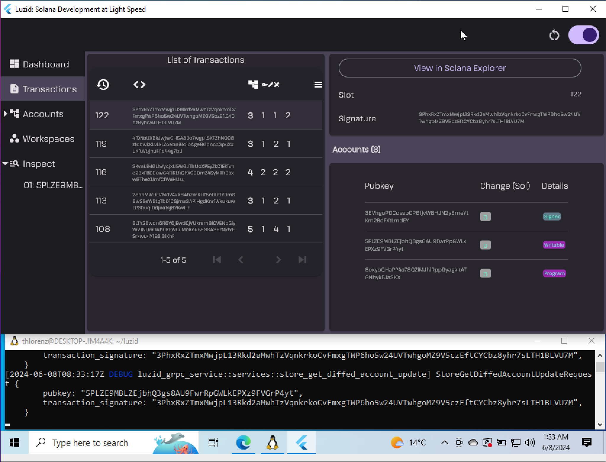

+++
title = "Luzid Alpha Release"
description = "Introducing the more modular Luzid"
date = 2024-06-09T15:00:00+00:00
updated = 2024-06-09T15:00:00+00:00
draft =  false
template = "blog/page.html"

[taxonomies]
authors = ["Thorsten Lorenz"]

[extra]
lead = "🎉 A more modular Luzid!"

[page]
toc = true
+++

As some of you may know I joined [MagicBlock](https://www.magicblock.gg/) in order to be able
to continue Luzid development and keep new releases coming while helping them provide the
community with the tools needed to build FOCGs (Fully On Chain Games) on Solana.

MagicBlock will support Luzid going forward as part of their open source tooling provided to
the entire Solana community.

## Modularity to Democratize Tooling

MagicBlock also wants to make these tools accessible to everyone and therefore
decided to make Luzid available to Windows developers as well as on Linux and MacOS were it
was already supported.

In order to do that we modularized Luzid into a backend which currently embeds the Solana
validator and a frontend which attaches to it in order to provide a convenient UI.

On Windows that backend can be run inside the WSL (Windows Subsystem for Linux) and the
frontend runs natively on Windows.

 
 

The other use case that is now possible is to deploy the Luzid backend remotely and connect the
UI running locally.

## Installing the new Version

Follow the release notes for either release:

- [Windows Release](https://github.com/luzid-app/luzid-sdk/releases/tag/windows-v0.0.3)
- [MacOS Release](https://github.com/luzid-app/luzid-sdk/releases/tag/macos-v0.0.3)
- [Linux Release](https://github.com/luzid-app/luzid-sdk/releases/tag/linux-v0.0.3)

If you run into any issues please post them inside the
`🪲 ︱luzid-issues` channel in the [MagicBlock Discord](https://discord.com/invite/MBkdC3gxcv).

## Coming up Shortly

MagicBlock wants to make all types of games and applications possible on Solana even if they
require thousands of transactions processed blazingly fast and state changes to be reflected in
real time.

Therefore a big part of my time at MagicBlock is spent building a **low latency validator**.

This validator will be bundled with the next version of Luzid and **boy is the Solana developer
community in for a treat**! Luzid will naturally inherit the improved performance of this
MagicBlock validator and testing your Solana programs locally will be incredibly fast thus shortening the
feedback loop even further.

And when I say "incredibly fast" I literally mean _incredibly_ fast, but you'll have to see it
to for your self 🔜

